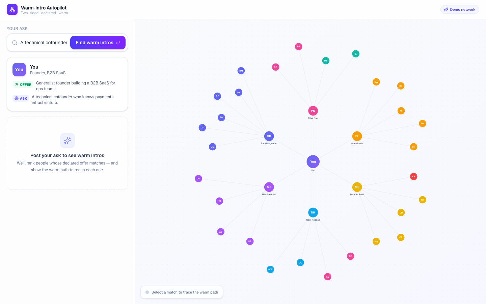
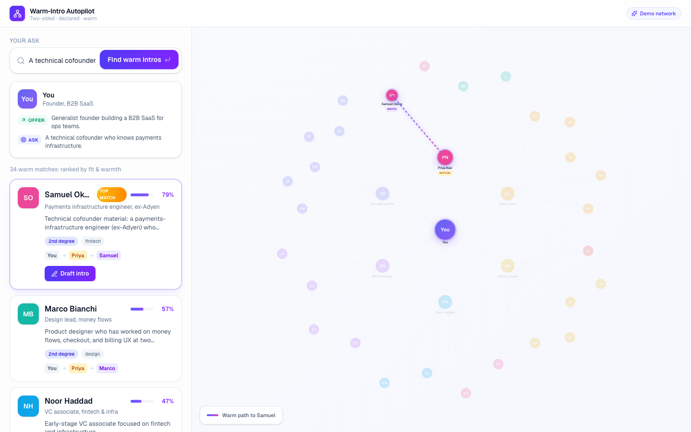
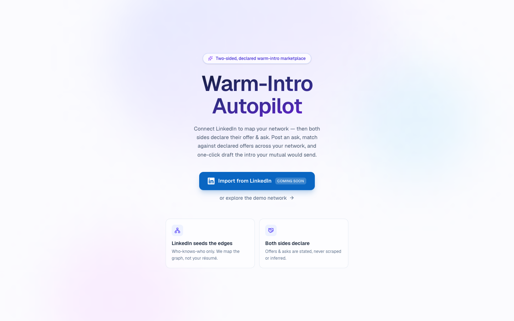

# Warmline — Warm-Intro Autopilot

**The only warm-intro marketplace where both sides declare what they offer and what they need.**

Happenstance, Swarm, and Vieu all infer intent from passive signals — LinkedIn activity,
calendar data, email metadata. Warmline is different: every person in your network
declares an explicit **offer** ("here's how I can help") and an explicit **ask** ("here's
what I need right now"). Post your ask and Warmline semantically matches it against
everyone's declared offers across your 1st- and 2nd-degree network, surfaces the warm
path to each match, and one-click drafts the intro your mutual contact would send — in
their voice, with double-opt-in framing.

Two-sided + declared beats one-sided + inferred because the signal is intentional,
current, and consent-first from day one.

---

## Screenshots

**Network ego-graph — idle state**



**Warm path highlighted — Samuel Okoro via Priya Nair**



**Onboarding — LinkedIn import (coming soon)**



---

## How it works

1. **Declare your offer and ask.** Every person in the network has a two-sentence offer
   ("what I can help with") and a two-sentence ask ("what I need right now"). These are
   explicit and editable — not inferred from passive behavior.

2. **Post your ask.** Type what you're looking for in plain English. Example:
   *"a technical cofounder who knows payments infrastructure"*.

3. **Semantic match across your warm network.** Warmline embeds your ask and every
   reachable person's declared offer using a local sentence model
   (`Xenova/all-MiniLM-L6-v2`, running entirely in-process — no API key, no data leaving
   your server). Cosine similarity finds meaning, not just word overlap: *"billing
   systems"* and *"billing and ledger systems"* score as near-identical even though they
   share no rare tokens.

4. **Warm-path BFS (depth 2).** Matching is scoped to your 1st- and 2nd-degree
   connections only. The final ranking blends semantic score (75 %) with path warmth
   (25 %), so a strong 2nd-degree semantic match can beat a weak direct connection —
   while closeness still nudges comparable-scoring people up.

5. **Animated warm-path graph.** The React Flow ego-graph lights up the exact path: *You
   → Priya Nair → Samuel Okoro*. You see who to ask, not just who to reach.

6. **One-click Claude-drafted intro.** Hit "Draft Intro" and Warmline sends the
   connector's identity, your ask, and the target's declared offer to Claude
   (`claude-sonnet-4-6`), which writes the message in the mutual's first-person voice
   with double-opt-in framing. When `ANTHROPIC_API_KEY` is unset, a deterministic
   template fills in automatically. The response surface always tells you which path was
   taken (`generatedBy: "claude" | "template"`).

---

## Golden-path demo

**Ask:** `a technical cofounder who knows payments infrastructure`

**Result #1:** Samuel Okoro — *"Payments infrastructure engineer, ex-Adyen"* — via Priya
Nair (2nd degree).

Samuel's declared offer: *"Technical cofounder material: a payments-infrastructure
engineer (ex-Adyen) who builds billing, ledger, and payment-rail systems from scratch."*

The semantic engine catches this match even though the ask says "payments infrastructure"
and the offer says "billing and ledger systems" — the sentence embeddings understand these
describe the same domain. A keyword matcher would miss it entirely.

---

## Architecture

| Layer | What it does |
|---|---|
| **Next.js 16 (App Router, Turbopack)** | Full-stack framework; API routes serve three stable endpoints |
| **`lib/engine/match.ts`** | Semantic match: `Xenova/all-MiniLM-L6-v2` via `@huggingface/transformers`, mean-pooled + L2-normalized, cosine similarity, offer vectors cached in-process |
| **`lib/engine/paths.ts`** | BFS depth-2 warm-path finder; builds an undirected adjacency map and returns the shortest path to every reachable persona |
| **`components/`** | React Flow ego-graph with animated warm-path highlights; ranked match cards; intro modal |
| **`lib/intro/claude.ts`** | Claude-drafted intros (`claude-sonnet-4-6`, Anthropic SDK); throws on error so the API route falls back to `templateIntro` cleanly |
| **`data/seed/network.ts`** | 94 personas across 12 communities (founders, fintech, healthtech, AI, design, infra, growth, climate, crypto, bio, investors, recruiters); edges clustered inside communities with sparse cross-cluster bridges |
| **No database** | All data flows through a module-level `getGraph()` call; swap internals to load from a real source without touching any API signatures |

### API (stable, frozen contract)

```
GET  /api/personas                    →  Graph  (nodes + edges for the viz)
POST /api/match  { ask, meId? }       →  MatchResponse  (ranked MatchResult[])
POST /api/intro  IntroRequest         →  IntroResponse  (drafted message + source)
```

---

## Running locally

```bash
npm install
npm run dev
# → http://localhost:3000
```

**Optional — enable Claude-drafted intros:**

```bash
ANTHROPIC_API_KEY=sk-ant-... npm run dev
```

Without the key the intro path falls back to a deterministic template automatically —
the app is fully functional either way.

**Smoke-test the engine:**

```bash
# Should return "Samuel Okoro" as the top result
curl -s -X POST http://localhost:3000/api/match \
  -H 'Content-Type: application/json' \
  -d '{"ask":"a technical cofounder who knows payments infrastructure"}' \
  | jq '.results[0].persona.name'

npm run build   # must stay green
```

---

## Built with parallel agents

The codebase was designed spine-first for parallel execution. The type contract
(`lib/types.ts`) and the three API signatures were frozen upfront, then three disjoint
agent tracks ran simultaneously with zero merge conflicts by design:

- **Track A — Engine:** local embedding pipeline, cosine similarity, offer-vector cache.
- **Track B — Frontend:** onboarding screen, ranked match cards, React Flow warm-path
  animation, intro modal.
- **Track C — Seed + Intro:** 94-persona clustered seed with hand-curated golden path,
  Claude intro module with template fallback.

The frozen contract let each track build and test in isolation against the same interface.
This is the same discipline a real multi-team product org uses — it just usually takes
weeks of planning meetings.

---

## Tech stack

- [Next.js 16](https://nextjs.org) (App Router, Turbopack) — deployed on Vercel
- [@huggingface/transformers](https://github.com/xenova/transformers.js) — local sentence embeddings, no API key required
- [React Flow](https://reactflow.dev) — interactive warm-path network graph
- [Anthropic SDK](https://github.com/anthropic-ai/sdk-python) / `claude-sonnet-4-6` — intro drafting
- TypeScript throughout

---

*Encode Vibe Coding Hackathon — June 2026*
